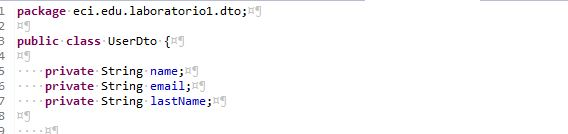
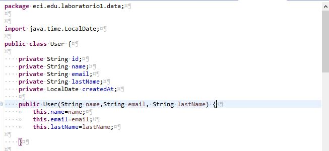
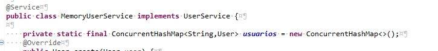
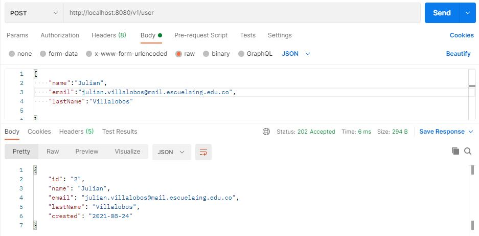

## Spring Boot Rest API

### Part 1: Implementing the Users Microservice RESTFUL API

1. Create a new project using the [Spring Initializr](https://start.spring.io/)
  * Use either *Java* or *Kotlin* as programming language.
  * Use Gradle as project option(if your computer is slow then use  Maven)
  * Add Spring Web dependency before generating the project.
2. Create a new repository on Github and commit the files generated in 1.
3. Create a new package called *dto* and inside define your *UserDto* object with at least the following fields:
    * name.
    * email.
    * lastName.
    

4. Create a new package called *data* and inside define your *User* data object with at least the following fields:
    * id.
    * name.
    * email.
    * lastName.
    * createdAt.

5. Create a new package called *service* an inside create the following interface:

6. Create an implementation of the UserService using a HashMap data structure inside.
7. Make your service implementation *UserServiceHashMap* injectable using the *@Service* annotation.

8. Create a new package called *controller* and create a new class *UserController* inside.
9. Annotate your *UserController* so it becomes a REST Controller:
10. Inject your UserService implementation inside the UserController via the constructor:

11. Implement all the endpoints needed to interact with you *UserService*. Use the following method signatures to help you achieve the Level 2 RESTFUL Maturity:

12. Download and install [Postman](https://www.postman.com/) and test ALL the endpoints of your API.

## Create()

     

## all()

## update()

#### Control Errores updade()

## delete()

#### Control Errores delete() 

## findById()

#### Control Errores delete() 

